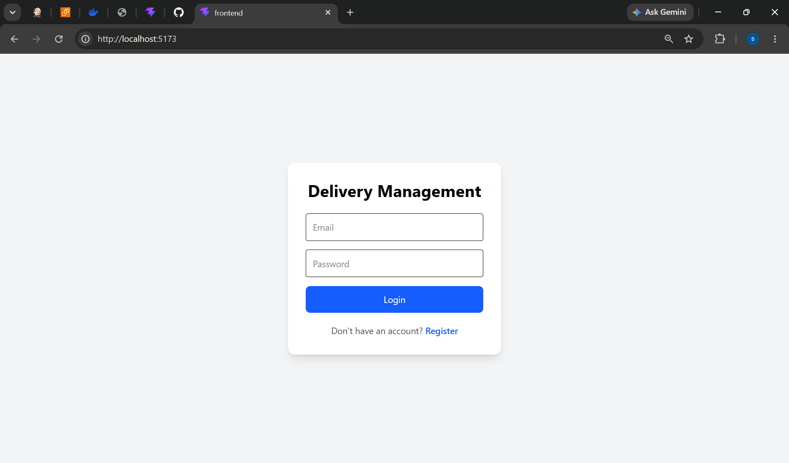
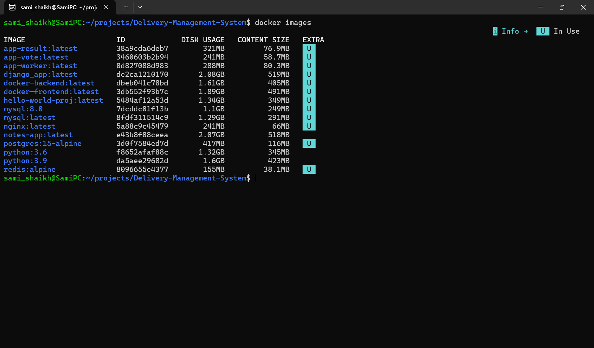
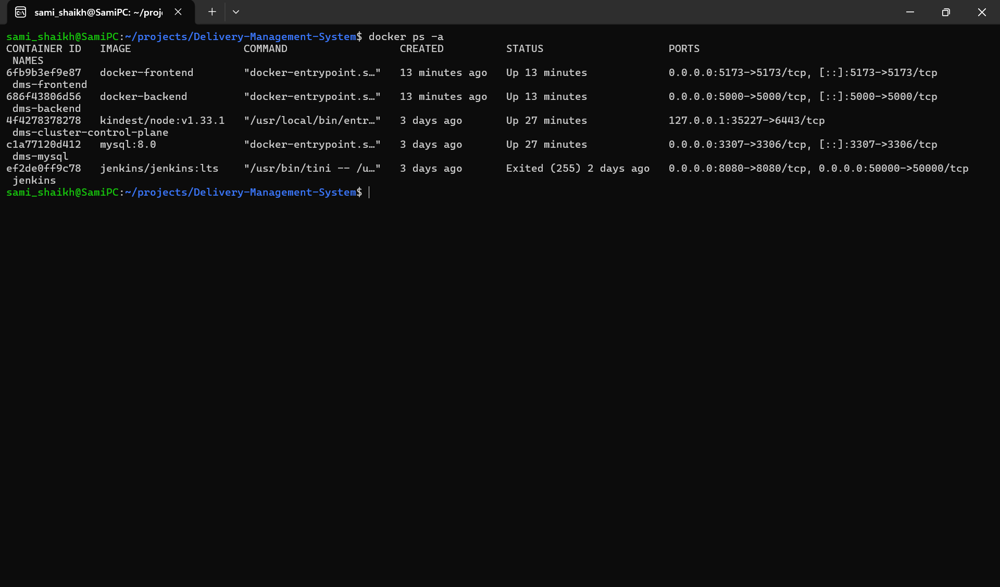
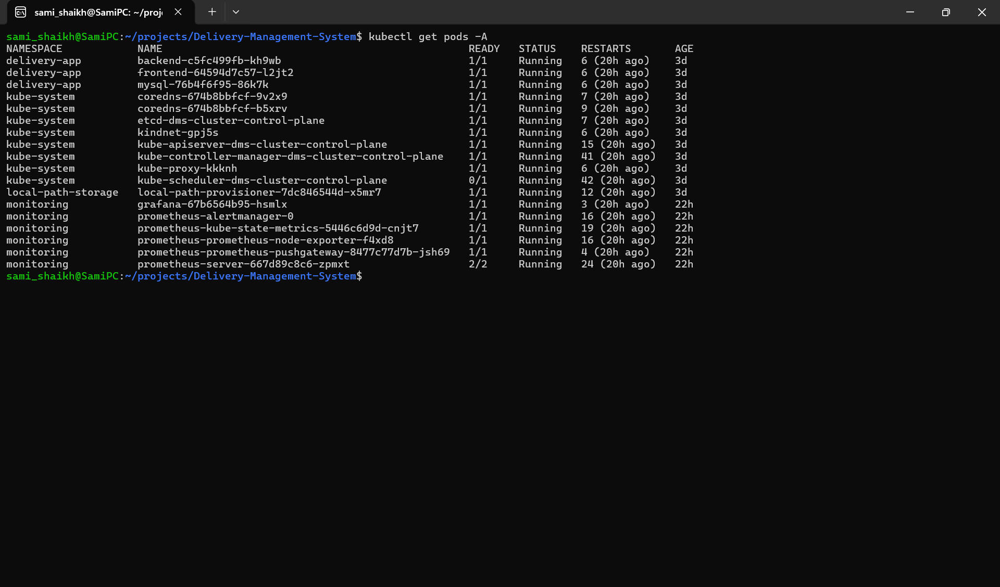
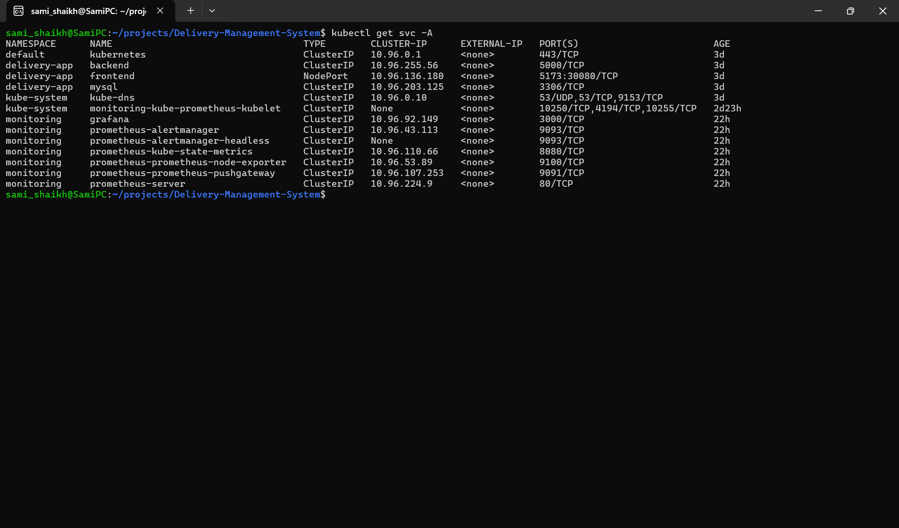
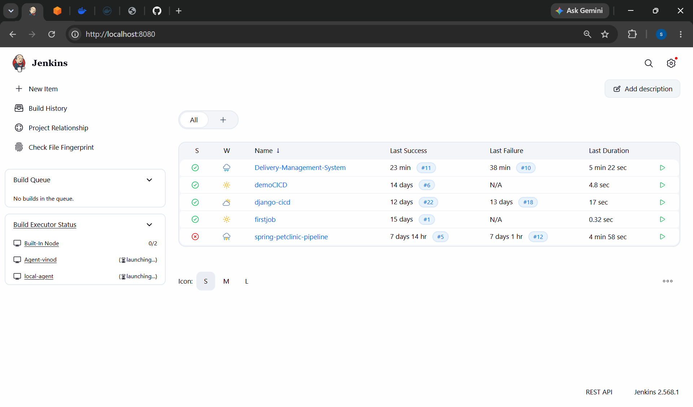
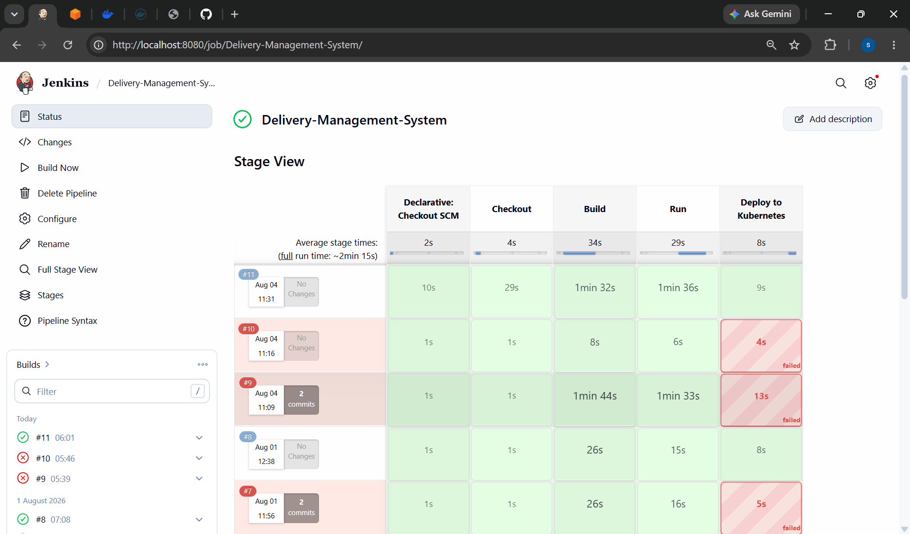
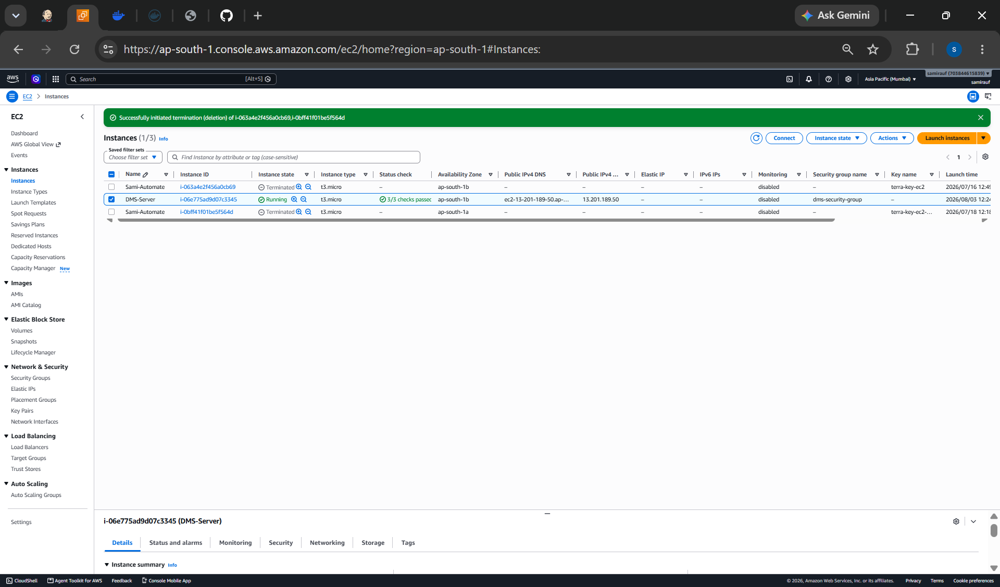

# 🚀 Delivery Management System

<p align="center">


</p>

---

# 📖 Project Overview

The **Delivery Management System** is a complete **End-to-End DevOps Project** developed to demonstrate modern DevOps practices using Docker, Kubernetes, Jenkins, Terraform, Prometheus and Grafana.

The project consists of a **React Frontend**, **Node.js Backend**, and **MySQL Database**. It is containerized using Docker, deployed on Kubernetes (Kind), automated through Jenkins CI/CD, infrastructure managed using Terraform, and monitored using Prometheus and Grafana.

This repository is designed for learning DevOps as well as showcasing a complete deployment pipeline.

---

# ✨ Key Features

- Modern React Frontend
- REST API using Node.js & Express
- MySQL Database Integration
- Dockerized Frontend & Backend
- Docker Compose Support
- Kubernetes Deployment using Kind
- Jenkins Continuous Integration
- Infrastructure as Code using Terraform
- Prometheus Monitoring
- Grafana Dashboards
- Git & GitHub Version Control
- Modular Project Structure

---

# 🛠️ Tech Stack

| Category | Technology |
|-----------|------------|
| Frontend | React + Vite |
| Backend | Node.js + Express |
| Database | MySQL 8 |
| Containers | Docker |
| Container Orchestration | Kubernetes (Kind) |
| CI/CD | Jenkins |
| Infrastructure | Terraform |
| Monitoring | Prometheus |
| Dashboard | Grafana |
| Version Control | Git & GitHub |
| Operating System | Ubuntu (WSL2) |
| Cloud | AWS |

---

# 🏗️ Project Architecture

```
                    Developer
                        │
                        ▼
                   GitHub Repository
                        │
                        ▼
                  Jenkins Pipeline
                        │
        Build Docker Images Automatically
                        │
                        ▼
                     Docker Hub
                        │
                        ▼
             Kubernetes (Kind Cluster)
        ┌─────────────────────────────┐
        │                             │
        ▼                             ▼
 React Frontend              Node.js Backend
                                      │
                                      ▼
                                 MySQL Database

                    Monitoring Layer
          Prometheus  ─────────► Grafana
```

---

# 📂 Project Structure

```text
Delivery-Management-System/
│
├── backend/
│   ├── config/
│   ├── controllers/
│   ├── middleware/
│   ├── models/
│   ├── routes/
│   ├── uploads/
│   ├── utils/
│   ├── app.js
│   ├── package.json
│   └── package-lock.json
│
├── frontend/
│   ├── public/
│   ├── src/
│   ├── index.html
│   ├── vite.config.js
│   ├── package.json
│   └── package-lock.json
│
├── database/
│   └── schema.sql
│
├── docker/
│   ├── backend.Dockerfile
│   ├── frontend.Dockerfile
│   └── docker-compose.yml
│
├── kubernetes/
│   ├── namespace.yml
│   ├── mysql-deployment.yml
│   ├── mysql-service.yml
│   ├── backend-deployment.yml
│   ├── backend-service.yml
│   ├── frontend-deployment.yml
│   └── frontend-service.yml
│
├── terraform/
│   ├── provider.tf
│   ├── variables.tf
│   ├── main.tf
│   ├── outputs.tf
│   └── terraform.tfvars
│
├── monitoring/
├── screenshots/
├── docs/
├── Jenkinsfile
└── README.md
```

---

# 🎯 Project Objectives

- Learn Docker Containerization
- Deploy applications on Kubernetes
- Build a Jenkins CI/CD Pipeline
- Provision Infrastructure using Terraform
- Monitor applications with Prometheus
- Visualize metrics using Grafana
- Practice Git & GitHub workflow
- Understand complete DevOps lifecycle

---

# ⚙️ Prerequisites

Before running this project, install the following software:

- Git
- Docker Desktop
- Ubuntu WSL2
- Node.js (v18 or later)
- MySQL 8
- Kubernetes (Kind)
- kubectl
- Helm
- Jenkins
- Terraform
- AWS CLI (Optional)

---

# 🚀 Installation Guide

## 1. Clone Repository

```bash
git clone https://github.com/SamiShaikh-123/Delivery-Management-System.git
cd Delivery-Management-System
```

---

## 2. Backend Setup

Move to backend directory

```bash
cd backend
```

Install dependencies

```bash
npm install
```

Start Backend

```bash
npm start
```

---

## 3. Frontend Setup

Move to frontend

```bash
cd frontend
```

Install dependencies

```bash
npm install
```

Run Frontend

```bash
npm run dev
```

---

# 🗄️ Database Setup

Login into MySQL

```bash
mysql -u root -p
```

Create Database

```sql
CREATE DATABASE delivery_management;
```

Import Schema

```bash
source database/schema.sql
```

---

# 🔐 Environment Variables

Create a `.env` file inside the backend folder.

Example

```env
PORT=5000

DB_HOST=mysql

DB_PORT=3306

DB_USER=root

DB_PASSWORD=yourpassword

DB_NAME=delivery_management

JWT_SECRET=your_secret_key
```

---

# 🐳 Docker

## Build Backend Image

```bash
docker build -f docker/backend.Dockerfile -t dms-backend .
```

## Build Frontend Image

```bash
docker build -f docker/frontend.Dockerfile -t dms-frontend .
```

## Start Containers

```bash
cd docker

docker-compose up --build
```

## Check Running Containers

```bash
docker ps
```

## Stop Containers

```bash
docker-compose down
```

---

# ☸️ Kubernetes Deployment

Create Namespace

```bash
kubectl apply -f kubernetes/namespace.yml
```

Deploy MySQL

```bash
kubectl apply -f kubernetes/mysql-deployment.yml
kubectl apply -f kubernetes/mysql-service.yml
```

Deploy Backend

```bash
kubectl apply -f kubernetes/backend-deployment.yml
kubectl apply -f kubernetes/backend-service.yml
```

Deploy Frontend

```bash
kubectl apply -f kubernetes/frontend-deployment.yml
kubectl apply -f kubernetes/frontend-service.yml
```

Verify Deployment

```bash
kubectl get all

kubectl get pods

kubectl get svc
```

---

# 🔄 Jenkins CI/CD Pipeline

The Jenkins pipeline performs the following tasks automatically:

- Pull latest code from GitHub
- Build Docker Images
- Push Docker Images
- Deploy to Kubernetes
- Verify Deployment

Pipeline File

```
Jenkinsfile
```

Run Build

Open Jenkins

Create Pipeline Job

Connect GitHub Repository

Click **Build Now**

---

# 🌍 Terraform Infrastructure

Terraform is used for provisioning AWS Infrastructure.

Move into terraform directory

```bash
cd terraform
```

Initialize Terraform

```bash
terraform init
```

Validate Configuration

```bash
terraform validate
```

Preview Changes

```bash
terraform plan
```

Create Infrastructure

```bash
terraform apply
```

Destroy Infrastructure

```bash
terraform destroy
```

Terraform Files

```
provider.tf

variables.tf

main.tf

outputs.tf

terraform.tfvars
```

---

# 📊 Monitoring

## Install Prometheus

```bash
helm repo add prometheus-community https://prometheus-community.github.io/helm-charts

helm repo update

kubectl create namespace monitoring

helm install prometheus prometheus-community/prometheus -n monitoring
```

---

## Install Grafana

```bash
kubectl create deployment grafana --image=grafana/grafana -n monitoring

kubectl expose deployment grafana --type=ClusterIP --port=3000 -n monitoring

kubectl port-forward svc/grafana 3000:3000 -n monitoring
```

Open Browser

```
http://localhost:3000
```

Default Login

```
Username : admin

Password : admin
```

---

# 🧪 Useful Commands

Docker

```bash
docker ps

docker images

docker logs <container-name>
```

Kubernetes

```bash
kubectl get pods

kubectl get svc

kubectl describe pod <pod-name>

kubectl logs <pod-name>
```

Terraform

```bash
terraform init

terraform plan

terraform apply

terraform destroy
```

Jenkins

```
Dashboard → Build Now → Console Output
```

---

# 📸 Project Screenshots

> **Note:** All screenshots are stored inside the `screenshots/` directory.

## 🏠 Home Page


---

## 🔐 Login Page



---

## 📦 Docker Images



---

## 🐳 Running Docker Containers



---

## ☸️ Kubernetes Pods



---

## 🌐 Kubernetes Services



---

## 🔄 Jenkins Dashboard



---

## ✅ Successful Jenkins Build



---

## 🌍 Terraform Apply


---

## ☁️ AWS EC2 Instance



---

## 📈 Prometheus Dashboard


---

## 📊 Grafana Dashboard


---

# 🔄 CI/CD Workflow

The project follows a complete Continuous Integration and Continuous Deployment pipeline.

```
Developer
      │
      ▼
Git Push
      │
      ▼
GitHub Repository
      │
      ▼
Webhook Trigger
      │
      ▼
Jenkins Pipeline
      │
      ▼
Clone Repository
      │
      ▼
Build Docker Images
      │
      ▼
Push Images
      │
      ▼
Deploy to Kubernetes
      │
      ▼
Application Running
      │
      ▼
Prometheus Monitoring
      │
      ▼
Grafana Dashboard
```

---

# 📋 Project Modules

### Frontend

- React.js
- Vite
- Responsive UI
- REST API Integration

### Backend

- Express.js
- REST APIs
- Authentication
- Business Logic

### Database

- MySQL Database
- SQL Schema
- CRUD Operations

### Docker

- Dockerfiles
- Docker Compose
- Multi-container Deployment

### Kubernetes

- Namespace
- Deployment
- Service
- Scaling

### Jenkins

- CI/CD Pipeline
- Automated Build
- Automated Deployment

### Terraform

- Infrastructure as Code
- EC2 Provisioning
- Security Group Management

### Monitoring

- Prometheus Metrics
- Grafana Dashboards

---

# 🛠️ Troubleshooting

## Docker

```bash
docker ps

docker logs <container>

docker-compose down

docker-compose up --build
```

## Kubernetes

```bash
kubectl get pods

kubectl describe pod <pod-name>

kubectl logs <pod-name>

kubectl get svc
```

## Jenkins

- Verify Jenkins is running.
- Check Console Output for build errors.
- Ensure Docker is running before building images.

## Terraform

```bash
terraform validate

terraform plan

terraform apply

terraform destroy
```

## Prometheus

```bash
kubectl get pods -n monitoring

kubectl logs <pod-name> -n monitoring
```

## Grafana

```bash
kubectl port-forward svc/grafana 3000:3000 -n monitoring
```

---

# 📚 Learning Outcomes

This project helped in learning:

- Docker Containerization
- Docker Compose
- Kubernetes Deployment
- Jenkins CI/CD
- Git & GitHub
- Infrastructure as Code
- Terraform
- AWS EC2
- Prometheus Monitoring
- Grafana Dashboards
- DevOps Workflow

---

# 🚀 Future Improvements

- Deploy on AWS EKS
- Configure NGINX Ingress Controller
- Enable HTTPS using TLS
- Add Horizontal Pod Autoscaler
- Implement GitHub Actions
- Implement ArgoCD GitOps
- Configure Alertmanager Notifications
- Add Logging using ELK Stack
- Deploy on Production Cloud

---

# 🤝 Contributing

Contributions are welcome.

1. Fork the repository.
2. Create a feature branch.
3. Commit your changes.
4. Push the branch.
5. Open a Pull Request.

---

# 📄 License

This project is developed for educational and learning purposes.

---

# 👨‍💻 Author

## Sami Shaikh

DevOps Enthusiast

GitHub:

https://github.com/SamiShaikh-123

---

# ⭐ Support

If you found this project useful, consider giving it a ⭐ on GitHub.

It motivates me to continue building and improving DevOps projects.

---

# 🙏 Acknowledgements

Special thanks to the open-source community and all the technologies used in this project:

- React
- Node.js
- Express
- MySQL
- Docker
- Kubernetes
- Jenkins
- Terraform
- Prometheus
- Grafana
- AWS
- GitHub

---

## 📬 Contact

If you have any questions or suggestions, feel free to connect through GitHub.